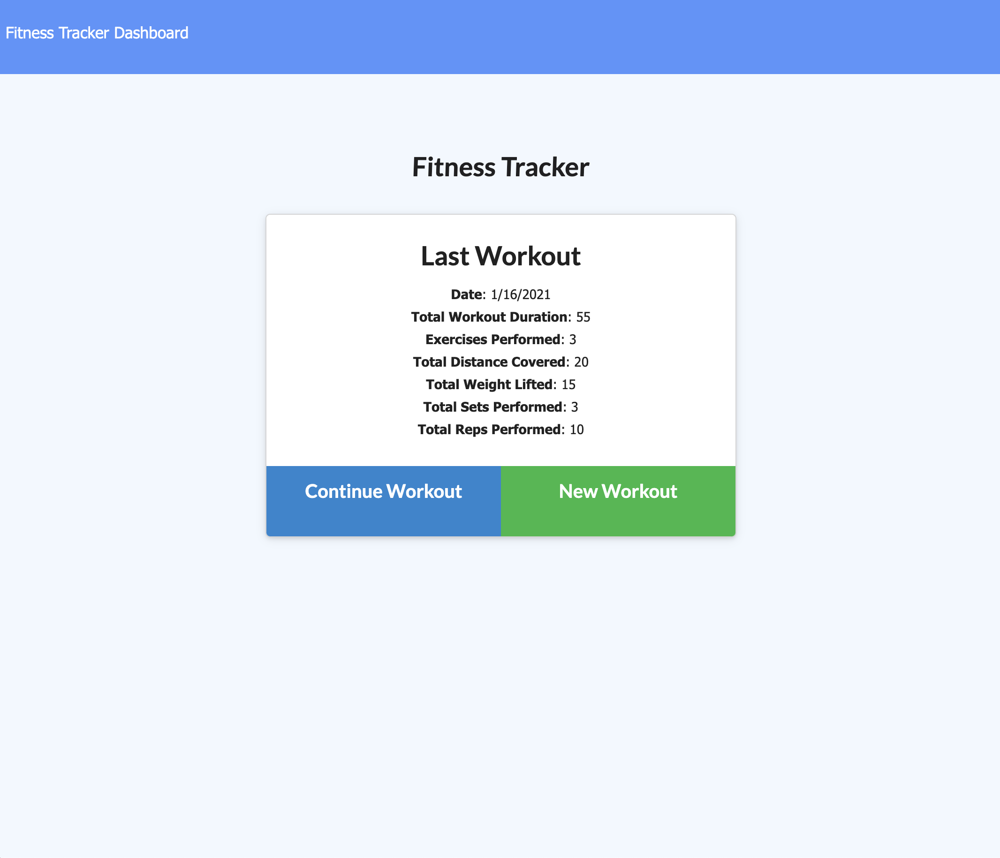
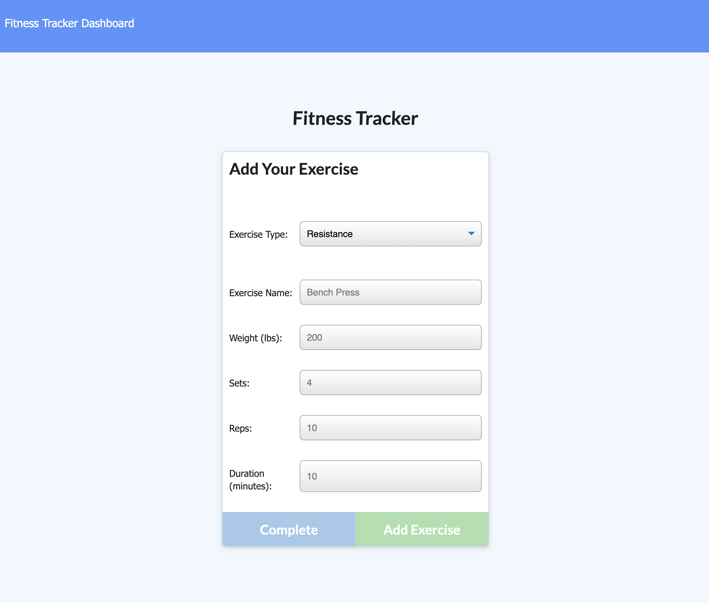
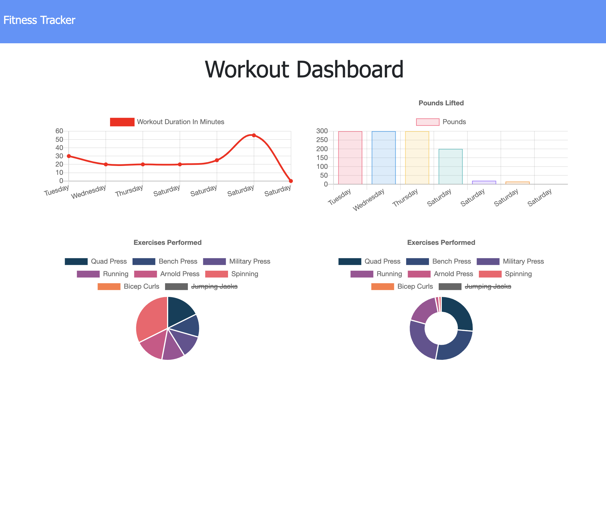

# Workout Tracker

Explore the [project page](https://github.com/cynthiwu/workout-tracker)

View it live on [Heroku](https://cryptic-shore-06162.herokuapp.com/)

## Table of Contents
- [About The Project](#about-the-project)
    - [Built With](#built-with)
- [Installation](#installation)
- [Usage](#usage)
  - [Demo](#demo)
- [Contributing](#contributing)
- [License](#license)
- [Contact](#contact)


## About The Project

The goal of this project was to build out the backend of the Workout Tracker Application, using a Mongo database and Mongoose schema to store and query data, along with Express to handle routes. 

<hr>



<hr>



<hr>



<hr>

### Built With

This project was built using:

* JavaScript
* jQuery
* [Node.js](https://nodejs.org/api/fs.html)
* [Express.js](https://expressjs.com/)
* [Mongodb](https://www.mongodb.com/)
* [Mongoose](https://mongoosejs.com/)

## Installation

While not necessary to run the program via the live link above, you may get a local copy up and running by following these simple steps:

1. Clone the repo
```sh
git clone git@github.com:cynthiwu/workout-tracker.git 
```

2. Install NPM packages (i.e., Inquirer)
```sh
npm install
```

## Usage

This project can be used to add, track and workouts athat are entered by the user. The user can enter a new workout, continue the most recent workout, or view charts that summarize their workout activity for the past 7 days.

### Demo

Watch the video below to see how the program works.


## Contributing

Contributions are what make the open source community such an amazing place to  learn, inspire, and create. Any contributions you make are **greatly appreciated**.

1. Fork the Project
2. Create your Feature Branch (`git checkout -b feature/AmazingFeature`)
3. Commit your Changes (`git commit -m 'Add some AmazingFeature'`)
4. Push to the Branch (`git push origin feature/AmazingFeature`)
5. Open a Pull Request

## License

None

## Contact

Cynthia Wu - [@cynthia21wu](https://twitter.com/cynthia21wu) - cynthia21wu@gmail.com

Project Link: [https://github.com/cynthiwu/workout-tracker](https://github.com/cynthiwu/workout-tracker)

Live Link:[https://cryptic-shore-06162.herokuapp.com/](https://cryptic-shore-06162.herokuapp.com/)
